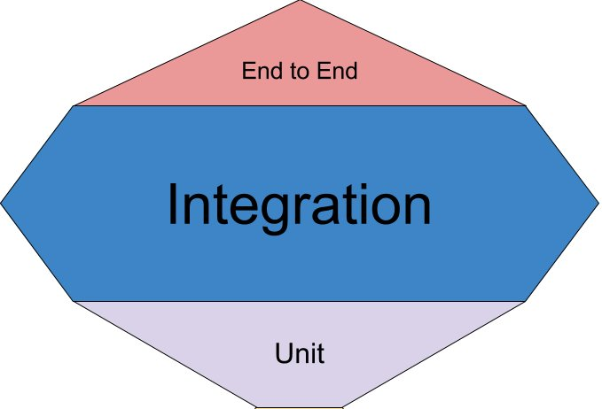
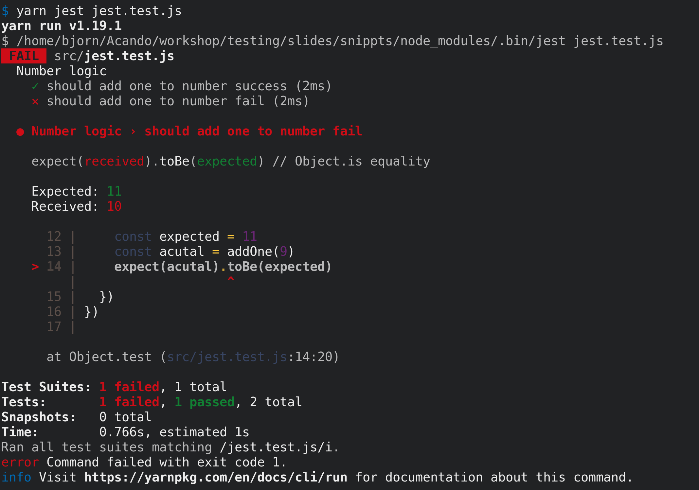
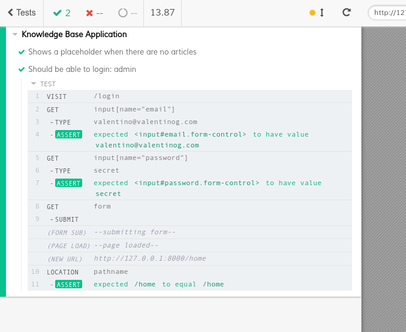

---?image=./img/bg.compressed.jpg
# @color[#f6f6f6](Testing)

Bjørn Gilstad
@snap[south span-100]
gitpitch.com/bjorngi/testing-workshop
@snapend

---
## Typer tester
* Enhetstester/Unit tester
* Integrasjontester
* Funksjonelle tester (E2E, end-to-end)

---
## Semantikk
* **Test launcher**
  * @size[0.7em](Programmet som kjører testene)
  * @size[0.7em](Jest, Karma, Jasmine, TestCafe, Cypress)

* **Assertion functions**
  * @size[0.7em](Funksjoner som evaluerer resultat av tester)
  * @size[0.7em](Chai, Jasmine, Jest, Unexpected, Expectedm TestCafe, Cypress)

---
## Semantikk
* Mocks, spies og stubs
  * @size[0.7em](*Doubles* som brukes i testing)
  * @size[0.7em](Sinon, Jasmine, enzyme, Jest, testdouble)
 
* Code coverage generatorer
  * @size[0.7em](Lager oversikt over hvilke deler/linjer av koden som er testet)
  * @size[0.7em](Istanbul, Blanket)

* Browser kontrollere

  * @size[0.7em](Tar kontroll over browser og simulerer bruk)
  * @size[0.7em](Selenium, Nightwatch, Nightmare, Phantom, Puppeteer, TestCafe, Cypress)

---
## Semantikk

* Accessibility testing
  * @size[0.7em]Sjekke universell utforming og best practices
  * @size[0.7em](Pa11y, lighthouse, AATT, Jest-axe)

* Regresjonstester
  * @size[0.7em](Tidligere laget tester som kjører og bekrefter at koden fremdeles fungerer)
  * @size[0.7em](Performance tester)

* Visual regression tests
  * @size[0.7em](Sjekker visuelle forskjeller)
  * @size[0.7em](Applitools, Percy, Wraith, WebdriverCSS)

---
## Test strategi
* Alle tester er bedre enn ingen tester
* Tester påvirker kode og arkitektur
* Highest value tests
* Test coverage "goals"

---
## Ikke bare tester
* Linting
* Statisk kodeanalyse
* Defensive coding
* Typing
* Kodekvalitet
* Lesbarhet
* Separation of concerns

---?color=white
@snap[west span-50]

@snapend

@snap[north east span-50]

@snapend

---
## Enhetstester
* Tester funksjoner eller klasser isolert
* Feedback under utvikling
* Raske
* Enkelt å lage
* Mocking/Injection
* Lett å teste **rene funksjoner**

  Jest
  Jasmine
  Mocha
  Karma

---
@code[ts](snippts/src/tests/jest.test.js)
---?color=#212224

---
## Oppgave 1
* Last ned eksempel kode:
  * https://github.com/bjorngi/testing-workshop
* Lag loading state
* Refaktorer og lag unit-tester (med Jest)

  Jest
  Jasmine
  Karma
  Karma

---
## Integrasjontester
* Tester flere deler sammen
  * @size[0.7em](funksjoner, klasser, komponenter)
* Stort spenn
* Uenighet i definisjon

  Jest
  Enzyme
  react-testing-library

---
## Oppgave 2
Legg integrasjonstester til prosjektet

Enzyme

---
## Oppgave 3
Generer test coverage

Instabul
Blanket

---
## Funksjonelle tester
* End-to-end
* Automatiserte tester av hele systemet
* Kjøres i miljøet som skal brukes

  Selenium
  Cypress
  Nightmare
  Nightwatch
  Puppeteer
  TestCafé

---
@code[ts](./examples/cypress.js)

---

---

## Oppgave 4
Sett opp funksjonelle tester til prosjektet

  Selenium
  Cypress
  Nightmare
  Nightwatch
  Puppeteer
  TestCafé

---
## Oppgave 5
Sett opp Accessibility Testing

  Pa11y
  AATT
  Lighthouse
  Jest-axe

---
## "Jobblekse"
Finn en kodesnutt i prosjektet ditt og skriv en test til den (trenger ikke å være din egen kode).
